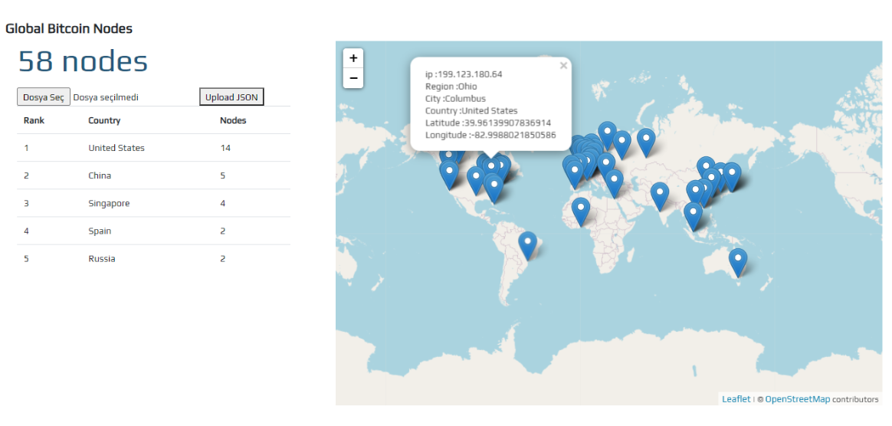

 # Bitcoin-Node-Analyzer

This project shows you bitcoin users that you uploaded as a JSON file.

## Installation
#### 1. Get JSON 
You can create your JSON file or use [java bitcoin scanner.](https://github.com/doodot/JBS)


##### 2. Clone the 

``` 
git clone https://github.com/mertpiree/Bitcoin-Node-Scanner.git
```


##### 3. Dependencies
In the project directory, install [django.](https://docs.djangoproject.com/en/3.1/howto/windows/)


##### 4. Firebase config
After create [firebase web](https://firebase.google.com/docs/web/setup?hl=en) application,configure your info in JavaScript code.

```JavaScript
const firebaseConfig = {
  apiKey: "",
  authDomain: "",
  databaseURL: "",
  projectId: "",
  storageBucket: "",
  messagingSenderId: "",
  appId: ""
};
```


##### 5. Start project
``` 
python .\manage.py runserver
```
and open django's default port.

## Site view




